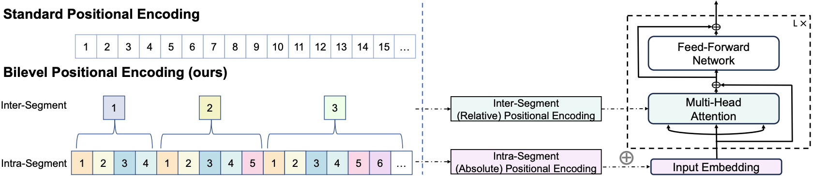

<h1 align="center">
Two Stones Hit One Bird: Bilevel Positional Encoding for Better Length Extrapolation 🔥, ICML 2024
</h1>

## News
🔥***May 2 2024***: *BiPE is accepted to ICML 2024!*   

🔥***Apr 11 2024***: *Release a 1.6B BiPE-RoPE model pre-trained on 300B tokens, demonstrating consistent extrapolation ability comparable to that of the 151 million-parameter version.*   

🔥***Apr 4 2024***: *Initial commits. More codes (YaRN finetuning, SCROLLs finetuning) are coming soon.*

## Overview
This repository contains the source code for 
* *Arxiv 2024* paper "[Two Stones Hit One Bird: Bilevel Positional Encoding for Better Length Extrapolation](https://arxiv.org/abs/2401.16421)", by Zhenyu He\*, Guhao Feng
*, Shengjie Luo\*, Kai Yang, Liwei Wang, Jingjing Xu, Zhi Zhang, Hongxia Yang, Di He. BiPE is a general framework for designing positional encodings for length extrapolation. In this repository, we instantiate two BiPE variants, BiPE-RoPE and BiPE-ALiBi.
* If you have questions, don't hesitate to open an issue or ask me via <zhenyu.h@outlook.com>. We are happy to hear from you!


**↓Overview of BiPE**


## Setup Environment
```shell
conda create -n bipe python=3.9
conda activate bipe
pip3 install -r requirements.txt
```

## Data for Pretraining
We use [the Pile](uncopyrighted) for pretraining with all copyrighted data removed.
```shell
cd BiPE;
DATA_DIR=./data # the directory to save the data
python3 download_data.py --dataset-cache-dir $DATA_DIR
```

## Pretraining
The scripts under script/ covers the commands for training and perpleixity evaluation.   

For training, the key modifications for BiPE are getting token ids (intra-segment) and position ids (inter-segment) by the `get_bilevel_ids` function. Then, the token ids are used to get absolute positional encodings (`get_ape_embeddings`) and the position ids are used to get relative positional encodings. For example, you can start training 151M BiPE-RoPE model with the following command:
```shell
cd BiPE
OUTPUT_DIR=./output  # path to save checkpoints and tensorboard
DATA_DIR=./data  # path to load data
CONFIG_NAME=config/bipe_rope.json
bash script/train.sh
```
You can change CONFIG_NAME to choose different positional encoding variants. (`choose from [config/bipe_rope.json, config/bipe_alibi.json, config/rope.json, config/alibi.json`)

## Perplexity Evaluation
For perplexity evaluation, you can use the following command:
```shell
cd BiPE;
DATA_DIR=./data  # path to load data
MODEL=./bipe_rope # model checkpoint path
bash script/eval.sh
```
    
     
You can also download our pre-trained models (Note that the 1.6B model is pre-trained with a batch size of 1024):
|Model|HuggingFace Checkpoint 🤗|
|----|---|
|BiPE_RoPE-151M|[link](https://huggingface.co/hzy00/BiPE_RoPE-151M)|
|BiPE_RoPE-1.6B|[link](https://huggingface.co/hzy00/BiPE_RoPE-1.6B)|
|RoPE-151M|[link](https://huggingface.co/hzy00/RoPE-151M)|
|BiPE_ALiBi-151M|[link](https://huggingface.co/hzy00/BiPE_ALiBi-151M)|
|ALiBi-151M|[link](https://huggingface.co/hzy00/ALiBi-151M)|
  
   
For example, to evaluate BiPE-RoPE-151M, you can use the following command:
```shell
git lfs install
git clone https://huggingface.co/hzy00/BiPE_RoPE-151M
DATA_DIR=./data  # path to load data
MODEL=./BiPE_RoPE-151M # model checkpoint path
bash script/eval.sh
```

## Citations
```

@inproceedings{
he2024two,
title={Two Stones Hit One Bird: Bilevel Positional Encoding for Better Length Extrapolation},
author={Zhenyu He and Guhao Feng and Shengjie Luo and Kai Yang and Liwei Wang and Jingjing Xu and Zhi Zhang and Hongxia Yang and Di He},
booktitle={Forty-first International Conference on Machine Learning},
year={2024},
url={https://openreview.net/forum?id=luqH1eL4PN}
}
```
